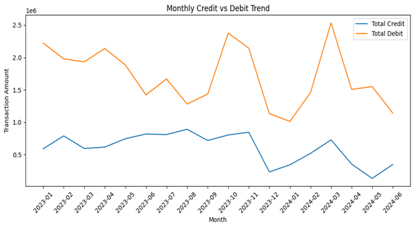
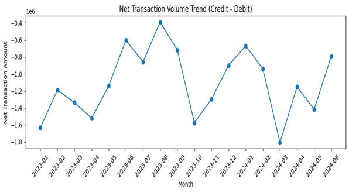
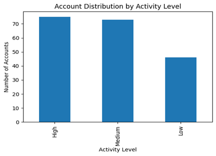
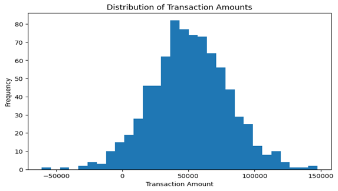
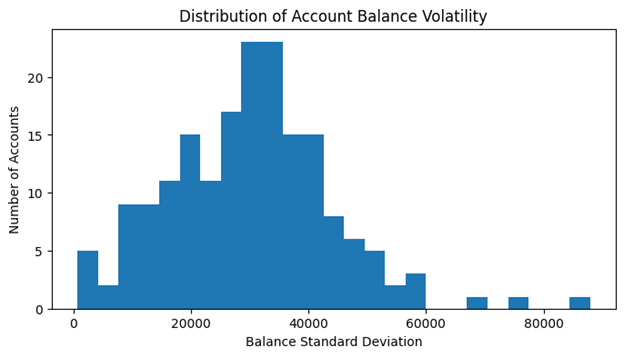
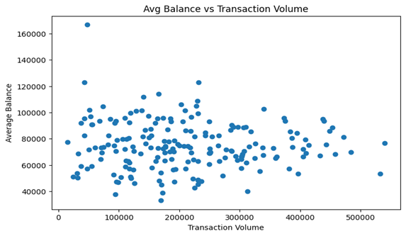

# JP Morgan Financial Risk Analysis Using Python

## Overview

This repository contains an end-to-end financial risk and customer behavior analysis based on transactional account data. The project is designed to demonstrate practical data analysis skills including data cleaning, exploratory analysis, customer profiling, risk identification, visualization, and statistical hypothesis testing.


## Business Problem

Banks need to understand customer transaction behavior and identify early warning signs of financial risk. This project addresses the following questions:

1. How do credits and debits behave over time across accounts?
2. Which accounts show strong net inflow and which show heavy net outflow?
3. Which accounts show risky patterns such as large withdrawals, unstable balances, or anomalous transactions?
4. Does high transaction volume reliably indicate higher average balance?


## Dataset Summary

The dataset contains transaction-level records including:

- Identifiers: TransactionID, CustomerID, AccountID
- Categorical fields: AccountType, TransactionType, Product, Firm, Region, Manager
- Numerical fields: TransactionAmount, AccountBalance, RiskScore, CreditRating, TenureMonths
- Date field: TransactionDate

Transaction types observed include Deposit, Withdrawal, Payment, and Transfer.


## Tools & Skills Used

- **Python**
 - Data cleaning, transformation, and analysis

- **Pandas & NumPy**
 - Data preprocessing, aggregation, and numerical analysis

- **Matplotlib & Seaborn**
 - Data visualization and exploratory analysis

- **Jupyter Notebook**
 - Interactive analysis and documentation

- **Exploratory Data Analysis (EDA)**
 - Trend analysis, KPI calculation, and pattern identification


## Approach Summary

The project was completed in the following stages:

1. Data cleaning and formatting
  - Converted date field into a consistent datetime format
  - Ensured financial fields were numeric and consistent
  - Standardized categorical values to avoid grouping errors
2. Descriptive transaction analysis
  - Monthly and yearly summaries of credits, debits, and net transaction volume
  - Credit versus debit trend analysis
  - Top and bottom accounts by net inflow
  - Dormant account detection using transaction gaps
3. Customer profile building
  - Activity level segmentation (High, Medium, Low) based on transaction frequency
  - Segmentation using average balance and transaction volume
  - Profile identification for high net inflow accounts, high frequency low balance accounts, and low/near-zero balance risk cases
4. Financial risk identification
  - Frequent large withdrawals detection
  - Balance volatility measurement using standard deviation
  - Anomaly detection using Z-score methodology
  - Combined risk flags for suspicious or irregular behavior
5. Visualization and exploratory analysis
  - Trend, distribution, segmentation, and risk-focused visuals
6. Hypothesis testing
  - Welch’s t-test to evaluate whether high-volume accounts have higher average balances than low-volume accounts


## Key Assumptions

1. Deposit is treated as credit (money in)
2. Withdrawal, Payment, and Transfer are treated as debit (money out)
3. Dormant accounts are defined as accounts with a transaction gap of 60 days or more between consecutive transactions
4. Anomaly detection uses a Z-score threshold of absolute value greater than 3


## Results Summary

1. Credits versus debits
  - Debit activity consistently exceeds credit activity across time periods, resulting in net outflow for the overall portfolio.
2. Account performance
  - A small subset of accounts contributes disproportionately to positive net inflow.
  - Several accounts show heavy net outflow and are candidates for monitoring.
3. Risk signals
  - Some accounts show large withdrawals, high balance volatility, and anomalous transaction behavior.
  - Combining multiple indicators strengthens risk detection compared to using a single metric.
4. Hypothesis test outcome
  - The statistical test did not show a significant difference in average balances between high-volume and low-volume transaction accounts.
  - Transaction volume alone should not be treated as a proxy for customer financial strength.


## Key Business Insights

1. Portfolio-level behavior indicates persistent net outflow, which may represent liquidity stress in certain customer segments.
2. High engagement does not always indicate financial stability; frequent transactions can occur alongside low average balances.
3. Balance volatility is a strong and practical monitoring feature because it highlights unstable account behavior.
4. Outlier transactions justify automated alerts, since extreme values occur even when most transactions are within a normal range.


## Recommendations

1. Monitoring and controls
  - Prioritize monitoring for accounts with high balance volatility and frequent large withdrawals.
  - Add automated alerts for anomalous transaction amounts identified through statistical thresholds.
2. Customer engagement strategy
  - Separate engagement-based segmentation from stability-based segmentation.
  - High-frequency low-balance accounts should receive proactive support and monitoring due to higher stress risk.
3. Customer value assessment
  - Do not use transaction volume alone to classify customer value.
  - Use a combination of net inflow, average balance, and balance stability for value and risk classification.


## Repository Structure

```
Jp-Morgan-financial-risk-analysis-python/
│
├── README.md
│
├── data/
│   ├── jp_morgan.csv
│   └── jp_morgan_cleaned.csv
│
├── notebooks/
│   └── Financial_Risk_Analysis.ipynb
│
├── reports/
│   └── Financial_Risk_Analysis_Report.pdf
│
└── visuals/
   ├── credit_vs_debit_trend.png
   ├── net_transaction_trend.png
   ├── transaction_amount_distribution.png
   ├── account_balance_distribution.png
   ├── balance_volatility_distribution.png
   ├── balance_vs_volume_scatter.png
   └── activity_level_distribution.png
```

## Screenshots

**Credit vs Debit Trend**



**Net Transaction Trend**



**Activity Level Distribution**



**Transaction Amount Distribution**



**Balance Volatility Distribution**



**Balance vs Transaction Volume**




## Video Walkthrough
A short video explaining the dashboards, insights, and business recommendations:

https://www.loom.com/share/221cbfd770e5409082f6af21ed8d0135


## How to Run Locally

1. Install Python 3.9 or higher
2. Install dependencies:
  pip install pandas numpy matplotlib scipy
3. Open and run the notebook:
  notebooks/Financial_Risk_Analysis.ipynb


## Notes for Reviewers

The notebook contains the full workflow, including data cleaning, analysis outputs, visualizations, and statistical testing. The PDF report provides a structured summary and includes the video link for the project walkthrough.


## Author

Dheeraj Marmat

Data Analyst Portfolio Project

